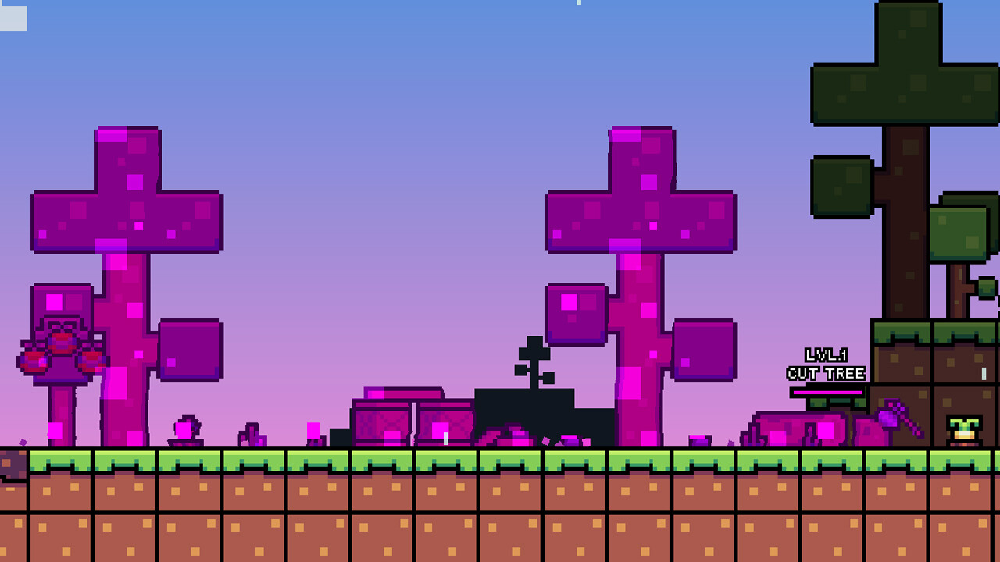
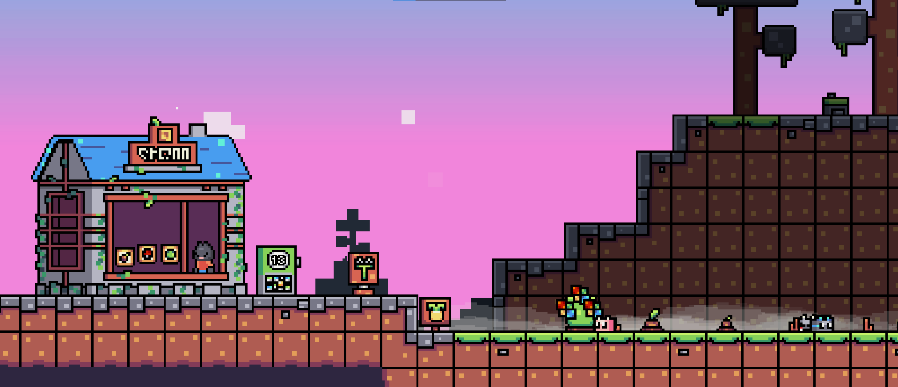
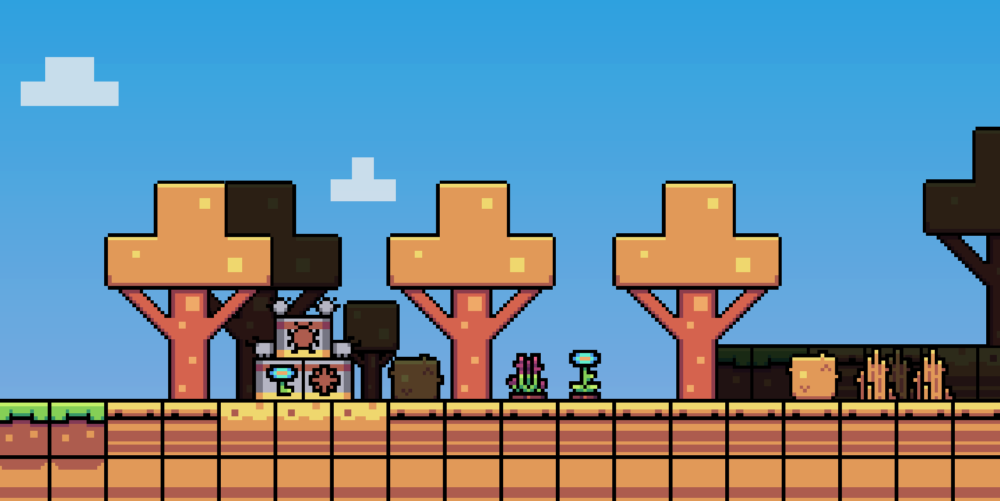
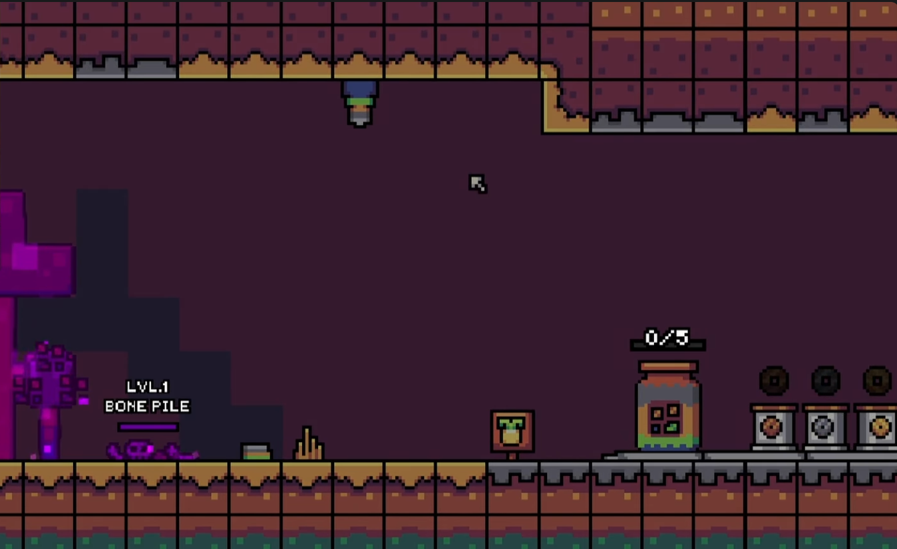
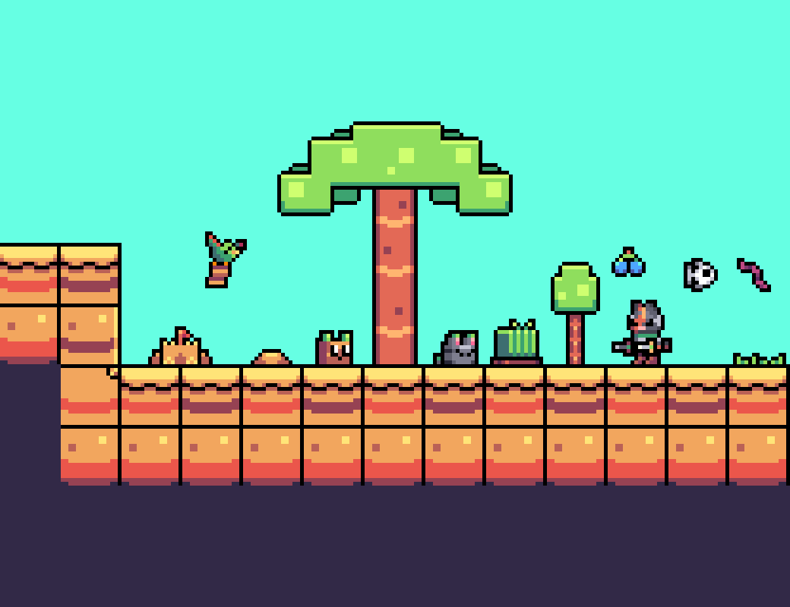
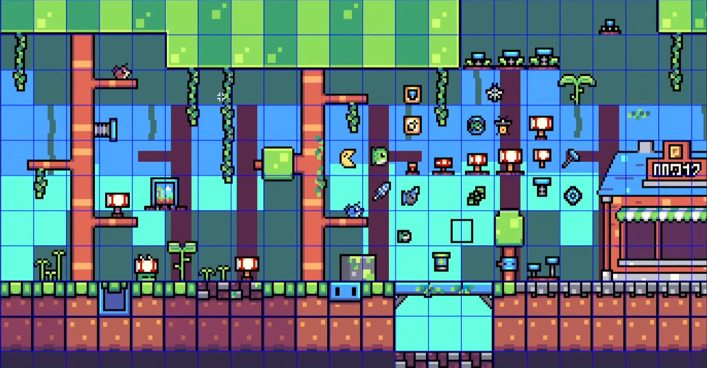

<link rel="stylesheet" href="../../assets/css/biomes.css">
Biomes are the main areas where the game takes place and comprise the main gameplay loop. Each biome has unique gellis, crops, corruption, and critters.

There are 2 biomes currently in-game with multiple others planned.

## Friendly Fields

\
(Friendly Fields as seen on the Steam store page)

Friendly fields is the first biome in the game and is where you start upon creating a new save. This biome has a few basic [crops](crops.md) that have no special functions. There are three gelli species here: Gelli, Leaflup, and Bonbon.

## Rocky Retreat

Rocky Retreat is the second biome in the game and has the unique mechanic of needing to mine in order to clear out the corruption. The crops here are a bit more interesting, having a progression where they increase in tier as you harvest them, giving better and better rewards. There are three new gelli species here: Biter, Pymtelli, and Golemini.

# Unreleased/Canceled Biomes

## Savannah/Desert

\
(Image is from the Discord teaser for the biome)

The savannah/desert biome is a cut biome (will be added after the initial release) with the main mechanics being crossbreeding crops to get new ones and catching bugs. It's located in the Kalacama Desert of Continaa. The biome has three gelli species: Mellifly, Gypbrick, and [REDACTED].

## Cozy Caverns

\
(Screenshot is from the "I Added Archeology To My Slime Farming Game!" video)

Cozy Caverns is an unreleased biome that takes place in a cave, with the main focus being finding ancient archaeological items and creating a museum of them. The biome has three gelli species: Tailil

## Festive Biome

The Festive biome is another unreleased biome, with the main mechanic being creating toys and upgrading machines to create more. The biome can still be found in the game's files, but it does not function ingame. There are no known gellis in this biome.

## Cartiffor's Cove

Cartiffor's Cove is a beach biome that is currently unreleased. The main focuses of the biome are Cartiffor, who spends most of her time here and brought her crew, and sand piles which spawn randomly and have a chance to contain rewards. There's also a bounty board next to the sell box that gives glim for obtaining the current item. There are two known gelli species in this biome: Felli and Sumblett.

## Hingewood Heights

\
(A screenshot of the concept art for Hingewood Heights)

Hingewood Heights is an unreleased retro-themed biome that takes place in a jungle-like area.

## Train Station

The Train Station is a playable location in the game, but it was originally planned to be its own biome. The corruption in the biome would be train parts that need to be cleansed in order to repair the train.

## Gourdkin Patch

The Gourdkin Patch is a cut biome that is themed around Halloween.

## Lumelria

Lumelria is another cut biome and is where Gelli World took place.

## Cooking Biome

The Cooking Biome is YET ANOTHER cut biome and had the main mechanic of... cooking.
