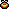
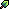

<link rel="stylesheet" href="../../assets/css/items.css">
# Items

Gelli Fields has 92 total items, which can often be categorized into four distinct categories:

- Crops/Fruits
- Seeds
- Critters
- Other

##  Crops

\
Crops (or fruits) are the products produced by growing seeds and harvesting the crops when they're done growing. Pretty self-explanatory.

##  Seeds

\
Seeds are used to plant crops and are often bought from the shop.

##  Critters

\
Critters are the item version of any critters (bugs or fish) that are caught. Their only use currently is to be sold.

##  Other

\
Other items are just general items you can find such as sticks, stones, and other random things.
